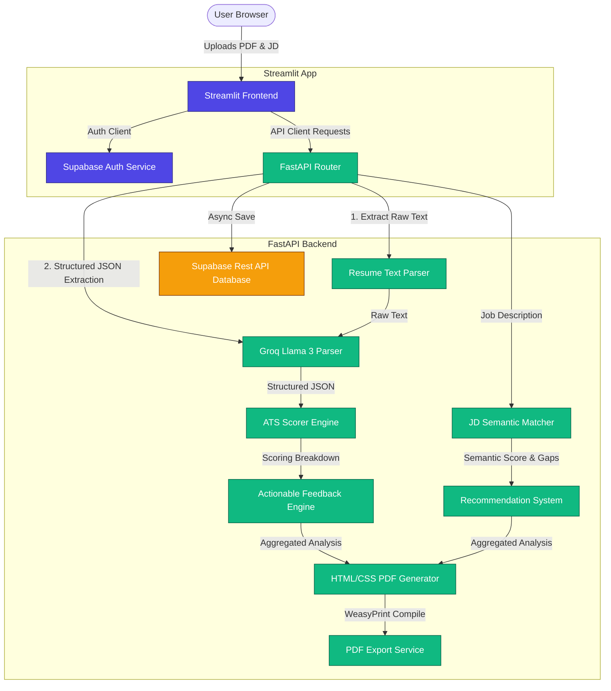

# 🧠 Technical Interview Preparation & Cross-Questions Guide

This guide prepares you to explain the **ATS Resume Scorer & Analyzer** in technical interviews. It contains the system architecture, component breakdowns, and deep cross-questions with professional answers.

---

## 1. System Architecture Diagram



---

## 2. Component Pipeline Workflow

1. **Extraction**: The file (PDF/DOCX) is processed locally using `pdfplumber` (primary) and `PyPDF2` (fallback) to extract raw textual data safely.
2. **Structuring (LLM)**: Raw resume text is processed through Groq's Llama 3.3 model using strict JSON schema instructions to return standardized JSON representations of the user's career profile.
3. **Semantic Matching**: SentenceTransformers embedding models map resume skills and job description keywords into a vector space, evaluating semantic similarities rather than just exact character strings.
4. **Heuristic Scoring**: Heuristic functions rate formatting, content quality, keyword counts, and skill validation proofs.
5. **Persistance**: Detailed JSON objects are saved to Supabase dynamically using an asynchronous HTTP POST handler.
6. **Reporting**: The dashboard aggregates findings and renders an exportable PDF using a Jinja2 template and WeasyPrint.

---

## 3. Deep Technical Cross-Questions & Answers

### Q1: Why did you use `FastAPI` + `Uvicorn` instead of a traditional framework like `Flask` or `Django`?
**Answer**: 
FastAPI is built on **Starlette** and is fully asynchronous. Our application depends on multiple external network/CPU-heavy operations (specifically waiting for Groq's Llama model API responses and executing deep learning models like SentenceTransformers).
- Flask is synchronous; every request blocks a worker thread. If 10 users upload resumes at the same time, Flask will quickly run out of threads and hang.
- FastAPI's async/await allows the event loop to yield execution during I/O bound tasks (like waiting for Groq API responses), serving hundreds of concurrent requests on a single worker thread.

---

### Q2: SentenceTransformers model loading takes up a lot of memory and time. How did you optimize this?
**Answer**:
We implemented FastAPI's **Lifespan Context Manager**. 
If we load the model inside the route controller (`@app.post("/analyze-resume")`), the model would be re-downloaded/re-loaded on every single request, causing a 10-second delay per scan.
By loading the model in the `lifespan` handler, we load the `all-MiniLM-L6-v2` transformer and the spaCy language pipelines once during the application boot process and cache them in the FastAPI `app.state` namespace. The active requests query the in-memory shared models, reducing individual scan latencies to less than 1.5 seconds.

---

### Q3: How do you handle cases where the LLM (Groq Llama 3) returns invalid or malformed JSON?
**Answer**:
Large Language Models are prone to hallucinating markdown formatting blocks (like wrapping responses in ` ```json ... ``` `) or trailing commas. To prevent application crashes:
1. We write a highly restrictive system prompt forcing the model to omit any introductory or conversational text and return ONLY raw JSON.
2. We implement a custom cleanup parser (`_try_parse_json`) that strips markdown code fences if the model fails to follow instructions.
3. If JSON loading still fails, we trigger an immediate **retry loop** with a stricter prompt explicitly pointing out the formatting error.
4. If that fails too, the system invokes the `with_fallback` module to generate a default structured profile, preventing the entire pipeline from failing.

---

### Q4: Explain the difference between Keyword Matching and Semantic Matching in your project.
**Answer**:
- **Keyword Matching (Exact/Fuzzy)**: Checks if specific skill tokens (e.g., "Python", "React") appear in the resume. We use spaCy's lemmatizer to convert words to their base forms first, meaning "analyzed", "analyzing", and "analyzer" are matched as the same token.
- **Semantic Matching (Embedding Similarity)**: Converts paragraphs of text into 384-dimensional dense vectors using the `all-MiniLM-L6-v2` SentenceTransformer. We measure the **Cosine Similarity** between the resume experience and the job description. Even if the resume says "designed cloud server systems" and the job description says "AWS infrastructure architect", the semantic engine matches them with high similarity scores because they share similar context.

---

### Q5: How do you secure your API routes against unauthorized scans?
**Answer**:
We secure routes using JWT verification integrated with **Supabase Auth**.
When the user signs in on the frontend, Supabase issues a JSON Web Token (JWT). The frontend API client attaches this token to the `Authorization: Bearer <token>` header of every scan request.
On the FastAPI backend, the `get_current_user` dependency uses PyJWT to decode and verify the token. It checks the signature using Supabase's JWKS (JSON Web Key Set) or the shared `SUPABASE_JWT_SECRET`. If the token is invalid or expired, it throws a `401 Unauthorized` exception immediately, preventing server resources from being wasted on unauthorized uploads.

---

### Q6: If you deploy this project to production, how will you handle scaling the ML model load?
**Answer**:
Deploying deep learning models like SentenceTransformers on a single CPU instance can create a severe bottleneck. To scale:
1. **Model Distillation**: We chose `all-MiniLM-L6-v2`, which is a lightweight model (~80 MB) optimized for CPU performance, offering 99% of the accuracy of larger models (like BERT-base) at a fraction of the computation time.
2. **Worker Pre-loading**: In production, we run FastAPI with Gunicorn workers (`gunicorn -w 4 -k uvicorn.workers.UvicornWorker`). To avoid loading 4 separate copies of the models (which would consume 4x the RAM), we load the models in the master process before worker forks are created, allowing workers to share the model memory footprint via Copy-on-Write (CoW).
3. **Decoupling/Serverless**: For massive scales, we would extract the ML embedding engine into a separate microservice (or run it as a serverless function on AWS Lambda/Modal) and call it via REST, keeping the API gateway lightweight.

---

### Q7: WeasyPrint requires system-level libraries like Pango/GObject. How did you configure this for local development?
**Answer**:
WeasyPrint relies on Gobject/Cairo to render visual layouts into PDFs. On Windows, these libraries are not included by default. 
To resolve this:
- We instruct developers to download the GTK+ package for Windows and add its directory to the system PATH.
- During code execution, we catch import errors gracefully. If WeasyPrint throws an error, the system outputs an informative log explaining how to configure the GTK dependency, ensuring the rest of the application (scoring, matching, and logging) remains functional.

---

### Q8: What security considerations should be kept in mind when parsing user-uploaded PDF and DOCX files?
**Answer**:
Parsing user-uploaded documents exposes the server to:
1. **Decompression Bombs (Zip Bombs)**: A DOCX file is essentially a zipped XML package. A small file (10 KB) can expand into gigabytes of data when unzipped, exhausting RAM. We restrict `maxUploadSize` to 10MB in our configurations and use file-size limits on the backend.
2. **Buffer Overflows**: Maliciously formed PDF binary files can exploit vulnerabilities in PDF parsers. We use mature, pure-Python libraries like `pdfplumber` and validate the mime-type of incoming files before processing them.
